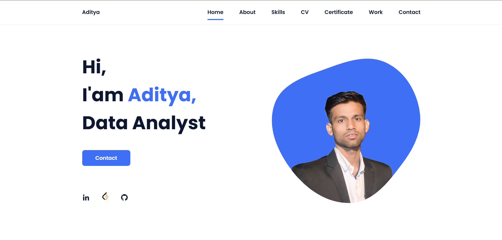

<h1 align="center">
  <a href="https://portfolio-l9rj.vercel.app/" target="_blank" title="Click to view my portfolio">
    🚀 Aditya Kumar Yadav's Portfolio Website
  </a>
</h1>

<p align="center">
  A modern, responsive, and professional portfolio website built using HTML, CSS, and JavaScript to showcase my skills, certifications, and projects.
</p>

---

## 📌 About Me

Hi, I'm **Aditya Kumar Yadav**, a passionate BCA student at **Lovely Professional University** with a keen interest in **Web Development**, **Data Analysis**, and **Software Engineering**. This is my personal portfolio website where I showcase my work, skills, and achievements.

---

## ⚙️ Tech Stack Used

- 💻 HTML5  
- 🎨 CSS3  
- 🧠 JavaScript (vanilla)  
- 🌐 Git & GitHub  

---

## 🌍 Live Preview

👉 [Click Here to View My Portfolio](https://portfolio-l9rj.vercel.app/)

---

## 🖼️ Portfolio Screenshot

<a href="https://portfolio-l9rj.vercel.app/" target="_blank">
  
</a>


---

## 🏆 Certificates

### ✔️ Crash Course on Python – Google  
🔗 [View Certificate](https://www.coursera.org/account/accomplishments/verify/BWN4GL5PUY9R)  
📄 [Download PDF](assets/certificate/Crash%20Course%20on%20Python.pdf)


## 📁 Project Structure

```
Portfolio/
├── assets/
│ ├── certificate/
│ │ ├── Crash Course on Python.jpg
│ │ └── Crash Course on Python.pdf
│ ├── certificates/
│ │ └── tableau_certificate.pdf
│ └── img/
│ └── certificate2.jpg
├── index.html
├── style.css
├── script.js
└── README.md
```


---

## 📬 Connect with Me

- 📧 Email: adityadav757@gmail.com  
- 🔗 GitHub: [github.com/adityadav-01](https://github.com/adityadav-01)  
- 💼 LinkedIn: [linkedin.com/in/adityadav-01](https://www.linkedin.com/in/adityadav-01)

---

## ⭐ Feedback

If you like this project, feel free to give it a ⭐ on GitHub. Your support motivates me to build more!
